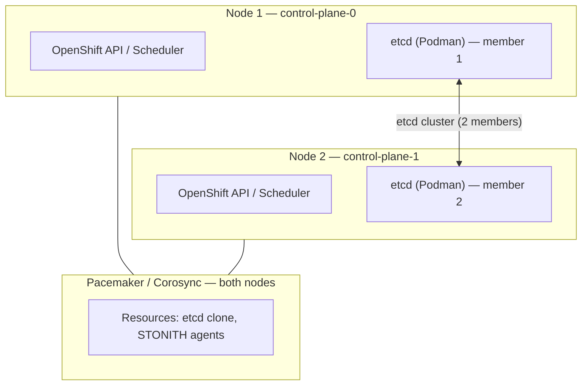
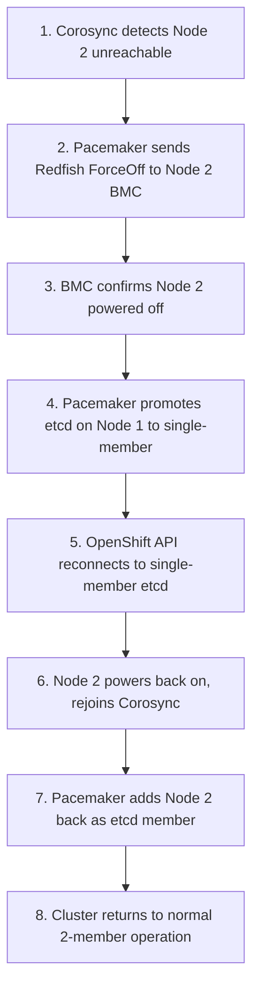
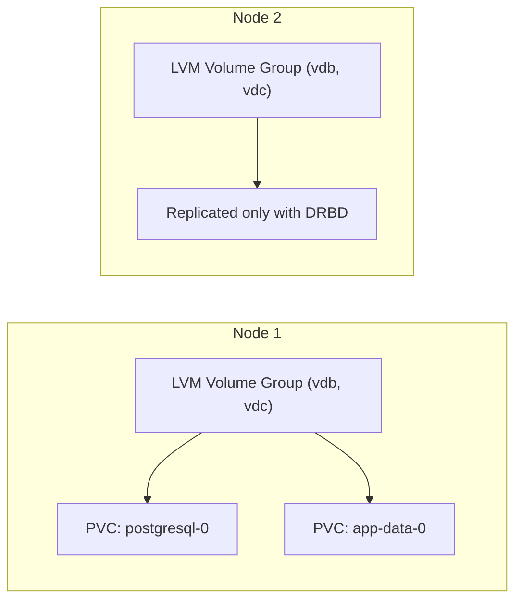

# Architecture Guide — Two-Node OpenShift with Fencing (TNF)

This document is a standalone reference for the TNF topology. You do not need hands-on cluster access to read and understand it.

---

## Table of Contents

1. [Two-Node Topologies: TNF vs TNA](#1-two-node-topologies-tnf-vs-tna)
2. [TNF Deep Dive: How It Works](#2-tnf-deep-dive-how-it-works)
3. [The Pacemaker / Corosync / STONITH Stack](#3-the-pacemaker--corosync--stonith-stack)
4. [etcd Outside the Cluster](#4-etcd-outside-the-cluster)
5. [Storage Architecture](#5-storage-architecture)
6. [Network Architecture](#6-network-architecture)
7. [Node Hardware Requirements](#7-node-hardware-requirements)
8. [Why Not the Original Module 3 Approach?](#8-why-not-the-original-module-3-approach)

---

## 1. Two-Node Topologies: TNF vs TNA

OpenShift 4.20+ introduced two separate two-node topologies that serve different use cases. Understanding the distinction is essential before choosing a deployment path.

| Feature | Two-Node with Fencing (TNF) | Two-Node with Arbiter (TNA) |
|---|---|---|
| Total Physical Nodes | **2** | **3** (2 full + 1 lightweight arbiter) |
| Quorum Mechanism | Pacemaker + BMC STONITH | Standard etcd (3 members) |
| etcd Management | Pacemaker via Podman, **outside** the cluster | Standard Cluster Etcd Operator (inside cluster) |
| Hardware Requirement | Bare metal with Redfish/IPMI BMC **required** | Virtual or physical (arbiter can be a small VM) |
| GA Status (OCP 4.22) | **Technology Preview** — `featureSet: TechPreviewNoUpgrade` | **Generally Available** |
| Upgrade Path | Requires full reinstallation | Standard OCP upgrade path |
| Network Plugin | OVNKubernetes (required) | OVNKubernetes (required) |
| Best For | Extreme edge with hard 2-server limit, air-gap | Retail, manufacturing, telecom at scale |

### Which should you use?

- **TNF (this repository)** — choose when you have exactly 2 physical servers and no flexibility to add a third. Accepts the Technology Preview risk and reinstall-to-upgrade constraint. Ideal for remote sites where minimizing hardware footprint is non-negotiable.

- **TNA (not covered here)** — choose when a third lightweight node (even a small VM on the same host) is acceptable. This is the GA-supported, production-ready path with a standard upgrade lifecycle. See the future enhancement note in [README.md](../README.md).

---

## 2. TNF Deep Dive: How It Works

### Normal Operation (Both Nodes Healthy)



etcd operates with 2 members. In a standard etcd cluster, 2 members cannot maintain quorum (quorum requires a majority: 2/3 for a 3-member cluster, but only 1/2 = 0.5 for a 2-member cluster — not a majority). TNF solves this by delegating quorum arbitration to Pacemaker rather than relying on etcd's built-in Raft consensus.

### Node Failure Sequence

When Node 2 becomes unresponsive:



**Why STONITH before etcd promotion?** This is the critical safety invariant. If Node 2 were merely unreachable (network partition) but still running, allowing Node 1 to promote etcd to a single-member cluster would create two isolated etcd instances — a split-brain condition. Both nodes would believe they are the authoritative etcd, leading to data divergence. STONITH guarantees Node 2 is powered off — not just partitioned — before any promotion happens.

---

## 3. The Pacemaker / Corosync / STONITH Stack

### Component Roles

| Component | Role in TNF |
|---|---|
| **Corosync** | Cluster communication and membership — detects node failures via heartbeats |
| **Pacemaker** | Resource management — starts/stops/monitors resources (etcd, STONITH agents) |
| **fence_redfish** | STONITH agent — issues Redfish power commands to BMC when a node must be fenced |
| **pcs** | CLI for managing Pacemaker/Corosync (configuration, status, resource control) |

### STONITH Resource Configuration

Each node requires a STONITH resource that targets the **other** node's BMC. The cross-targeting is intentional: each node manages fencing of its peer.

```bash
# Create STONITH resource for fencing Node 2 from Node 1
pcs stonith create fence-node2 fence_redfish \
  ipaddr="<node2-bmc-ip>" \
  username="<bmc-user>" \
  password="<bmc-password>" \
  systems_uri="/redfish/v1/Systems/<system-id>" \
  pcmk_host_list="node2" \
  power_timeout=40 \
  login_timeout=20 \
  op monitor interval=60s

# Create STONITH resource for fencing Node 1 from Node 2
pcs stonith create fence-node1 fence_redfish \
  ipaddr="<node1-bmc-ip>" \
  username="<bmc-user>" \
  password="<bmc-password>" \
  systems_uri="/redfish/v1/Systems/<system-id>" \
  pcmk_host_list="node1" \
  power_timeout=40 \
  login_timeout=20 \
  op monitor interval=60s
```

### Key Pacemaker Properties for TNF

```bash
# Disable quorum policy (Pacemaker handles quorum via STONITH, not vote count)
pcs property set no-quorum-policy=ignore

# Enable STONITH (required — cluster will not manage resources without it)
pcs property set stonith-enabled=true

# Set fencing delay on one node to break symmetry during simultaneous failures
pcs property set stonith-watchdog-timeout=10
```

### Verifying Cluster Health

```bash
# Overall cluster status (run on either node)
pcs status

# Expected output (healthy):
# Cluster name: <cluster-name>
# Stack: corosync
# Current DC: node1 (version ...) - partition with quorum
# 2 nodes configured
# Resources: fence-node1, fence-node2, etcd
# Online: [ node1 node2 ]
# Active resources:
#   fence-node1    Started node2
#   fence-node2    Started node1
#   etcd           Started node1 node2 (clone)

# Detailed STONITH status
pcs stonith show

# Pacemaker resource constraints
pcs constraint show
```

---

## 4. etcd Outside the Cluster

### Why etcd Runs in Podman, Not as an OpenShift Pod

Standard OpenShift runs etcd as pods managed by the Cluster Etcd Operator (CEO). The CEO handles member health, certificate rotation, and quorum. This works for 3+ node clusters where losing one node still leaves a quorum majority.

On a two-node cluster, the CEO cannot manage recovery from a single-node failure because:
1. With 2 members, losing one leaves 1/2 — not a quorum majority.
2. The CEO itself runs as an OpenShift operator. If the cluster loses quorum, the CEO cannot run. If the CEO cannot run, etcd cannot recover. A circular dependency.

TNF breaks this circular dependency by running etcd as a **Podman container** on each node — outside the OpenShift pod lifecycle. Pacemaker, which runs directly on the host OS (not inside OpenShift), can manage etcd independently of whether OpenShift is operational.

### etcd Data Directory

etcd data is stored at `/var/lib/etcd` on each node. This directory persists across fencing events, reboots, and etcd container restarts. It is mounted as a volume into the Podman container.

```bash
# Verify etcd container and data directory (run on a node)
podman ps | grep etcd
ls -lh /var/lib/etcd/

# Check etcd health from inside the container
podman exec etcd etcdctl endpoint health \
  --cacert /etc/kubernetes/static-pod-resources/etcd-member/ca.crt \
  --cert /etc/kubernetes/static-pod-resources/etcd-member/system:etcd-peer:node1.crt \
  --key /etc/kubernetes/static-pod-resources/etcd-member/system:etcd-peer:node1.key

# List etcd members
podman exec etcd etcdctl member list \
  --cacert /etc/kubernetes/static-pod-resources/etcd-member/ca.crt \
  --cert /etc/kubernetes/static-pod-resources/etcd-member/system:etcd-peer:node1.crt \
  --key /etc/kubernetes/static-pod-resources/etcd-member/system:etcd-peer:node1.key
```

### What `oc get etcd` Shows

Because etcd is no longer managed by the CEO, `oc get etcd -o yaml` will show a degraded or unusual status for the etcd cluster operator. **This is expected behavior for TNF.** Do not use the CEO's status as the primary health indicator. Use `pcs status` and `etcdctl endpoint health` instead.

---

## 5. Storage Architecture

### Why ODF/Ceph Is Not Used

Red Hat OpenShift Data Foundation (ODF) uses Ceph as its underlying storage engine. Ceph requires a minimum of 3 OSD (Object Storage Daemon) nodes to maintain quorum. On a two-node cluster, Ceph cannot achieve quorum without a third node — making standard ODF incompatible with the TNF topology.

### Primary Storage: LVM Operator (TopoLVM)

The **LVM Operator** provisions local block storage on each node using LVM volume groups. It creates `StorageClass` objects backed by local LVM logical volumes. PersistentVolumeClaims (PVCs) are bound to a specific node's local storage.



**Implication for HA workloads**: A PVC bound to Node 1's local storage cannot be accessed by a pod running on Node 2. For planned failover (drain), the pod must be rescheduled and the PVC must follow. For stateful `StatefulSet` workloads, this means:

- **Planned maintenance** (node drain): the pod reschedules to the surviving node. If the PVC was on the drained node, the pod waits for the node to return — or the workload must use replicated storage.
- **Unplanned failure** (fencing): the pod is rescheduled, but the PVC on the failed node is inaccessible until the node recovers.

For zero-RPO storage across node failures, use DRBD (see below).

### Developer Preview Storage: ODF + DRBD

ODF on Two-Node OpenShift with DRBD is a **Developer Preview** feature as of ODF 4.21. DRBD (Distributed Replicated Block Device) replicates a block device across both nodes at the kernel level, enabling a "floating" PVC accessible from either node.

> **Warning**: This is Developer Preview. The following ODF features are **not available** in this configuration:
> - NooBaa (object storage)
> - NFS server
> - RGW (RADOS Gateway / S3)
> - Regional Disaster Recovery

See [demos/05-drbd-edge-storage/](../demos/05-drbd-edge-storage/README.md) for the demonstration and setup instructions.

### Storage Recommendations by Workload

| Workload Type | Recommended Storage | Notes |
|---|---|---|
| etcd (Pacemaker-managed) | Local NVMe/SSD | Latency-sensitive — use fastest available disk |
| Stateless workloads | Any | EmptyDir, ConfigMap — no PVC needed |
| Stateful with planned failover only | LVM Operator | Acceptable if nodes are reliably recoverable |
| Stateful requiring node-failure HA | DRBD (Dev Preview) | See Demo 5 |
| Object storage | Not available | No ODF NooBaa on two-node |

---

## 6. Network Architecture

### Required: OVNKubernetes

TNF requires **OVNKubernetes** as the CNI plugin. OpenShiftSDN is deprecated as of OCP 4.14 and is not supported for this topology.

OVNKubernetes provides:
- Logical network topology managed by Open Virtual Network (OVN)
- Native NetworkPolicy enforcement
- EgressIP and EgressFirewall support
- IPv4/IPv6 dual-stack capability

### Network Interfaces

A typical TNF deployment uses the following networks:

| Network | Purpose | VLAN Recommendation |
|---|---|---|
| Machine network | Node OS, OVN underlay, cluster API VIP | Routable — bastion must reach this |
| BMC/IPMI network | Redfish STONITH access | Can be isolated; nodes must reach each other's BMC |
| (Optional) Storage network | Dedicated data replication (DRBD) | Recommended for DRBD to avoid contention with cluster traffic |

### API and Ingress VIPs

TNF uses virtual IPs (VIPs) that float between nodes:

- **API VIP** (`api.<cluster-name>.<base-domain>`): Floating IP for the Kubernetes API server
- **Ingress VIP** (`*.apps.<cluster-name>.<base-domain>`): Floating IP for application ingress

Both VIPs are managed by `keepalived`, which is deployed by the installer. They move automatically to the surviving node when a failover occurs.

---

## 7. Node Hardware Requirements

| Resource | Minimum | Recommended |
|---|---|---|
| CPU | 8 cores (x86_64) | 16+ cores |
| RAM | 32 GB | 64 GB |
| Boot/OS disk | 120 GB SSD | 200 GB NVMe |
| etcd disk | Separate NVMe preferred | 50+ GB NVMe, dedicated partition |
| Additional disks | 1× for LVM Operator | 2× for LVM + DRBD |
| BMC | Redfish 1.0+ (iDRAC, iLO, XCC, Supermicro) | Any Redfish-capable BMC |
| Network | 1 GbE minimum | 10 GbE recommended |

> **etcd Disk Latency**: TNF etcd is particularly sensitive to disk I/O latency. Red Hat recommends an `fio` baseline test before deployment: etcd write latency should be under 10ms at the 99th percentile. Slow disks are the most common cause of etcd stability warnings. See [troubleshooting.md](troubleshooting.md#slow-disk-latency-warnings).

### KVM Development Environment

For development and testing without physical hardware:

| Resource | Requirement |
|---|---|
| Host CPU | VT-x or AMD-V enabled, 8+ cores |
| Host RAM | 64 GB recommended (32 GB minimum) |
| Host disk | 400 GB free for VM images |
| Redfish emulator | `sushy-tools` (sushy-emulator) |
| libvirt network | Dedicated bridge or NAT network for cluster |

---

## 8. Why Not the Original Module 3 Approach?

Module 3 of the `retail-edge-ha-workshop` attempted to run the two-node cluster inside KubeVirt VMs on an OpenShift hub cluster, using `fakefish-kubevirt` as a Redfish emulator. This approach failed for several interconnected reasons:

| Problem | Root Cause | Impact |
|---|---|---|
| MAC address regeneration | KubeVirt VMs regenerate MACs on restart | ABI static network config broken after every reboot |
| Nested virtualization degradation | KubeVirt requires `cpu.features: vmx` | Performance insufficient for OCP control plane workloads |
| UDN network unreachability | KubeVirt UDN not routable from bastion | `openshift-install agent wait-for install-complete` could not connect |
| fakefish-kubevirt fragility | Not a real Redfish implementation | STONITH operations mapped to K8s API calls — unreliable under load |
| Hub cluster dependency | Entire setup required a working RHACM hub | A single hub cluster failure broke all edge cluster deployments |

The new approach (this repository) eliminates all of these problems by targeting real hardware or KVM with `sushy-tools` directly, without any nesting or hub cluster dependency.
