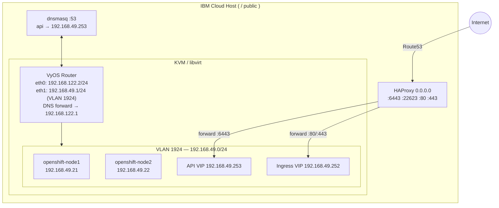
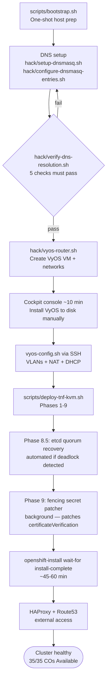
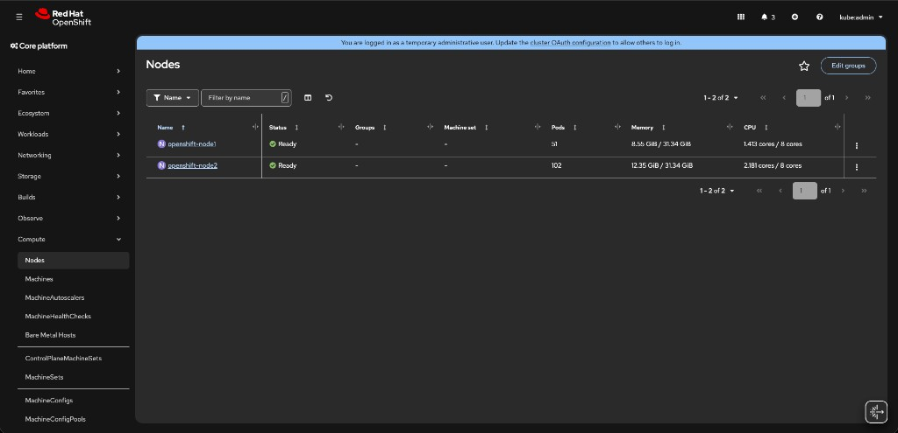
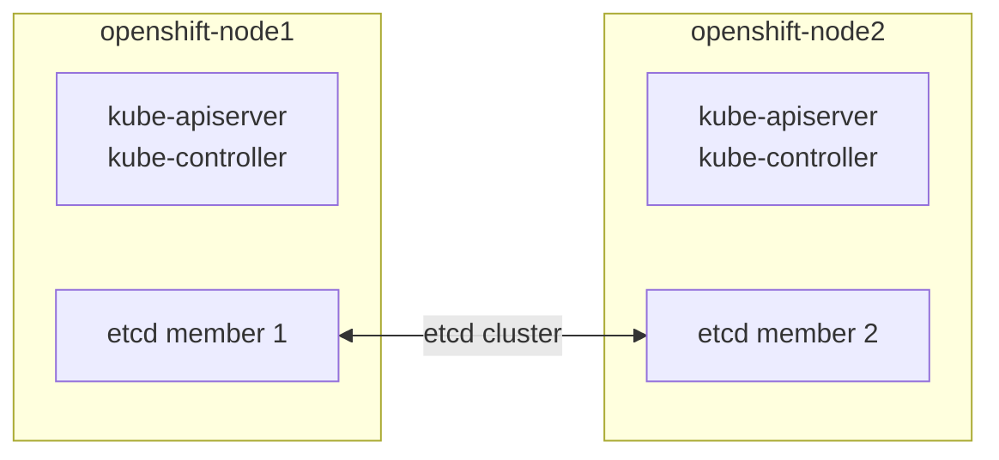

# KVM Developer Guide — Two-Node OpenShift on IBM Cloud

> This guide documents the KVM development environment for deploying a Two-Node
> OpenShift 4.22 cluster with Fencing (TNF) on an IBM Cloud bare-metal host.
> It is based on and closely follows the
> [openshift-agent-install developer guide](https://tosin2013.github.io/openshift-agent-install/developer-guide.html)
> and [IBM Cloud deployment guide](https://tosin2013.github.io/openshift-agent-install/ibm-cloud-deployment.html),
> with TNF-specific and IBM Cloud-specific customisations.

---

## Quick Start (TL;DR)

> Prerequisites: root access, `~/pull-secret.json`, `~/.aws/credentials`, AWS Route53 hosted zone for your domain.

```bash
# 1. Bootstrap the host (packages, OCP binaries, dnsmasq, SSH keys)
export HOST_PRIVATE_IP="<your-host-private-ip>"
sudo -E bash ~/openshift-twonode-guide/scripts/bootstrap.sh

# 2. Configure DNS + VyOS router
cd ~/openshift-agent-install
sudo ./hack/configure-dnsmasq-entries.sh add examples/two-node-fencing/cluster.yml
./hack/verify-dns-resolution.sh examples/two-node-fencing/cluster.yml   # all 5 must be ✅
export ACTION=create && sudo bash hack/vyos-router.sh
# → Open Cockpit at https://<YOUR-PUBLIC-IP>:9090, install VyOS to disk (~10 min)
# → Then run: sshpass -p 'vyos' scp -o StrictHostKeyChecking=no ~/vyos-config.sh vyos@192.168.122.2:/tmp/ && sshpass -p 'vyos' ssh -o StrictHostKeyChecking=no vyos@192.168.122.2 'vbash /tmp/vyos-config.sh'

# 3. Deploy the cluster (fully automated — ~60 min)
sudo bash ~/openshift-twonode-guide/scripts/deploy-tnf-kvm.sh
```

> For external access via Route53 see [Step 5b](#step-5b--route53-dns-ibm-cloud-external-access).
> For troubleshooting see the [Troubleshooting](#troubleshooting) section.

---

---

## Architecture Overview



| Component | Value |
|-----------|-------|
| Host private IP | `<HOST-PRIVATE-IP>` |
| Host public IP | `<YOUR-PUBLIC-IP>` |
| Base domain | `<YOUR-BASE-DOMAIN>` |
| Cluster FQDN | `twonode.<YOUR-BASE-DOMAIN>` |
| VyOS default network | `192.168.122.2/24` |
| VLAN 1924 gateway | `192.168.49.1` |
| Cluster node 1 | `192.168.49.21` |
| Cluster node 2 | `192.168.49.22` |
| API VIP | `192.168.49.253` |
| Ingress VIP | `192.168.49.252` |

---

## Deployment Flow



---

## Step 0 — Bootstrap Host (One-Shot)

Run `scripts/bootstrap.sh` as root. It is fully idempotent — safe to re-run.

```bash
sudo bash ~/openshift-twonode-guide/scripts/bootstrap.sh
```

**What it installs / configures:**

| Task | Details |
|------|---------|
| System packages | `qemu-kvm`, `libvirt`, `cockpit`, `cockpit-machines`, `dnsmasq`, `haproxy`, `fence-agents-redfish`, `nmstate`, `podman`, `ansible-core` |
| yq | v4.45.1 → `/usr/local/bin/yq` (required by all `hack/` scripts) |
| sushy-tools | Redfish emulator for KVM power management |
| OCP 4.22.0-rc.5 binaries | → `~/openshift-agent-install/bin/` AND `/usr/local/bin/` |
| Ansible collections | From `playbooks/collections/requirements.yml` |
| SSH key pair | `~/.ssh/openshift-twonode-ed25519` |
| Cockpit admin user | `cockpit-admin` with password saved to `~/cockpit-credentials.txt` |
| Registry auth | `~/.docker/config.json` from `~/pull-secret.json` |
| dnsmasq base config | `/etc/dnsmasq.d/openshift.conf` — listens on `127.0.0.1`, `::1`, `<HOST-PRIVATE-IP>` |

**After bootstrap**, the Cockpit console is available at:
```
https://<YOUR-PUBLIC-IP>:9090
```
Credentials are in `~/cockpit-credentials.txt`.

---

## Step 1 — DNS (Must Come Before VyOS)

dnsmasq on the host serves cluster DNS. VyOS must be able to forward to it on startup.

```bash
cd ~/openshift-agent-install

# Add cluster DNS entries
sudo ./hack/configure-dnsmasq-entries.sh add examples/two-node-fencing/cluster.yml

# MANDATORY verification gate — all 5 checks must be green
./hack/verify-dns-resolution.sh examples/two-node-fencing/cluster.yml
```

Expected output:
```
1. API endpoint        (api.twonode.example.com):        ✅ 192.168.49.253
2. Internal API        (api-int.twonode.example.com):    ✅ 192.168.49.253
3. Console             (console-...apps...):             ✅ 192.168.49.252
4. OAuth               (oauth-...apps...):               ✅ 192.168.49.252
5. Generic apps        (test.apps.twonode.example.com):  ✅ 192.168.49.252
✅ All DNS tests passed!
```

> **Why DNS first?** Our custom dnsmasq on the host (`<HOST-PRIVATE-IP>`) runs
> `hack/verify-dns-resolution.sh` to gate the deployment — all 5 cluster DNS checks
> must pass before VMs are deployed. VyOS itself forwards DNS to `192.168.122.1`
> (libvirt's built-in dnsmasq). `deploy-on-kvm.sh` injects cluster-specific entries
> into that libvirt dnsmasq via `virsh net-update default add dns-host`.
> HAProxy on the host handles the external access path (ports 6443/80/443 →
> cluster VIPs) — see [HAProxy Forwarder Guide](https://tosin2013.github.io/openshift-agent-install/haproxy-forwarder-guide.html).

---

## Step 2 — Storage: Format /dev/vdb

```bash
# One-time — format the 1 TB data disk for VM images
sudo mkfs.ext4 -L vmimages /dev/vdb
sudo mkdir -p /var/lib/libvirt/images
echo "LABEL=vmimages /var/lib/libvirt/images ext4 defaults 0 2" | sudo tee -a /etc/fstab
sudo mount /var/lib/libvirt/images
df -h /var/lib/libvirt/images   # should show ~934 GB free
```

---

## Step 3 — VyOS Router: Automated + Semi-Manual

### 3a. Run the script (automated)

```bash
cd ~/openshift-agent-install
export ACTION=create
sudo bash hack/vyos-router.sh
```

This script:
1. Reads `DNS_FORWARDER=<HOST-PRIVATE-IP>` from `/etc/resolv.conf`
2. Creates libvirt networks **1924, 1925, 1926, 1927, 1928** (isolated VLANs)
3. Downloads the VyOS rolling nightly ISO (~600 MB from GitHub)
4. Creates a 20 GB qcow2 disk for VyOS
5. Starts `virt-install` with 6 NICs (default + VLANs 1924–1928)
6. Downloads `vyos-config.sh` and substitutes `1.1.1.1 → <HOST-PRIVATE-IP>`
7. **Waits up to 30 minutes** for the manual console steps below

> Script output is saved to `/tmp/vyos-manual-config-instructions.txt`.

### 3b. Manual console steps via Cockpit (~10 minutes)

Open **Cockpit**: `https://<YOUR-PUBLIC-IP>:9090`  
Login with credentials from `~/cockpit-credentials.txt`

Navigate: **Virtual Machines → vyos-router → Console**

**Login**: `vyos` / `vyos`

#### Install VyOS to disk

```
install image
```

Accept all prompts with Enter (defaults). The VM will reboot automatically.

After reboot, click **Power Off** → **Run** in Cockpit, then re-open the Console tab.

#### Login again, configure eth0 and enable SSH

```
configure

# eth0 — VyOS side facing the libvirt default network
set interfaces ethernet eth0 address 192.168.122.2/24
set interfaces ethernet eth0 description 'Internet-Facing'
set protocols static route 0.0.0.0/0 next-hop 192.168.122.1

# DNS forwarding — forward queries to the libvirt default network dnsmasq.
# 192.168.122.1 is the libvirt dnsmasq that gets cluster DNS entries injected
# by hack/deploy-on-kvm.sh (via virsh net-update default add dns-host).
set service dns forwarding listen-address 192.168.122.2
set service dns forwarding allow-from 192.168.0.0/16
set service dns forwarding name-server 192.168.122.1

# SSH access (needed for vyos-config.sh in 3c)
set service ssh port 22
set service ssh listen-address 0.0.0.0

commit
save
exit
```

> **DNS flow for cluster nodes:**
> VM (VLAN 1924) → VyOS @ 192.168.49.1 → libvirt dnsmasq @ 192.168.122.1 → resolves
> cluster entries (api, api-int) that `deploy-on-kvm.sh` injects via `virsh net-update`.
> HAProxy on the host (bind `0.0.0.0`) separately handles external→cluster traffic
> on ports 6443/80/443.

**Verify** from the host:
```bash
ping -c 3 192.168.122.2   # must respond before continuing
```

### 3c. Apply VLAN configuration via SSH (automated)

`vyos-config.sh` is placed at `/root/vyos-config.sh` (runs as sudo via `vyos-router.sh`).
Copy it to your user home before SCP:

```bash
# Copy from root home to your user home
sudo cp /root/vyos-config.sh ~/vyos-config.sh
sudo chown $USER:$USER ~/vyos-config.sh

# Install sshpass for non-interactive SSH (default VyOS password is 'vyos')
sudo dnf install -y sshpass

# Transfer and apply
sshpass -p 'vyos' scp -o StrictHostKeyChecking=no ~/vyos-config.sh vyos@192.168.122.2:/tmp/
sshpass -p 'vyos' ssh -o StrictHostKeyChecking=no vyos@192.168.122.2 \
  'chmod +x /tmp/vyos-config.sh && vbash /tmp/vyos-config.sh'
```

`vyos-config.sh` applies:
- `eth1` → `192.168.49.1/24` (VLAN 1924, our cluster network)
- `eth2`–`eth5` → further VLANs 1925–1928
- NAT masquerade for all VLAN subnets via eth0
- DHCP servers for each VLAN (`name-server <HOST-PRIVATE-IP>` — our host dnsmasq)

### 3d. Add DNS listen-addresses for all VLAN gateways

`vyos-config.sh` configures DNS forwarding to listen on `192.168.122.2` only.
You must add the VLAN gateway IPs so cluster nodes can reach DNS at `192.168.49.1:53`:

```bash
cat > /tmp/vyos-dns-fix.sh << 'EOF'
#!/bin/vbash
source /opt/vyatta/etc/functions/script-template
configure
set service dns forwarding listen-address 192.168.49.1
set service dns forwarding listen-address 192.168.50.1
set service dns forwarding listen-address 192.168.52.1
set service dns forwarding listen-address 192.168.54.1
set service dns forwarding listen-address 192.168.56.1
commit
save
exit
EOF

sshpass -p 'vyos' scp -o StrictHostKeyChecking=no /tmp/vyos-dns-fix.sh vyos@192.168.122.2:/tmp/
sshpass -p 'vyos' ssh -o StrictHostKeyChecking=no vyos@192.168.122.2 'vbash /tmp/vyos-dns-fix.sh'
```

### 3e. Verify VLAN networking and DNS

```bash
sudo virsh net-list --all
# Expected: default + 1924 + 1925 + 1926 + 1927 + 1928 — all active

ping -c 3 192.168.49.1          # VyOS VLAN 1924 gateway — must respond

# Confirm full DNS chain: host → VyOS(192.168.49.1) → libvirt dnsmasq(192.168.122.1)
dig @192.168.49.1 api.twonode.example.com +short       # must return 192.168.49.253
dig @192.168.49.1 api-int.twonode.example.com +short   # must return 192.168.49.253
dig @192.168.49.1 console-openshift-console.apps.twonode.example.com +short  # must return 192.168.49.252
```

---

## Step 4 — Deploy VMs and Generate Agent ISO

TNF requires `controlPlane.fencing.credentials` in `install-config.yaml` before ISO generation.
The upstream `hack/create-iso.sh` does not handle this. Our custom script
`scripts/deploy-tnf-kvm.sh` handles the full lifecycle in the correct order:

```
1. sushy-emulator  → macvlan BMC interface at 192.168.122.10:8000
2. Create VMs      → virt-install (no ISO yet), captures libvirt UUIDs
3. Patch ISO       → ansible-playbook + Python injects fencing credentials
4. Boot VMs        → attach ISO and start
5. Watch/monitor   → reboot watcher + wait-for bootstrap/install-complete
```

### 4a. Full deployment (single command)

```bash
sudo bash ~/openshift-twonode-guide/scripts/deploy-tnf-kvm.sh
```

The script blocks until `install-complete`, printing progress live.

### 4b. Generate ISO only (skip VM creation/boot)

Useful if VMs already exist or for inspecting the generated ISO:

```bash
# First run (creates VMs and captures UUIDs)
sudo bash ~/openshift-twonode-guide/scripts/deploy-tnf-kvm.sh --iso-only

# Subsequent ISO regeneration (reads UUIDs from cache)
sudo bash ~/openshift-twonode-guide/scripts/deploy-tnf-kvm.sh --iso-only
```

### 4c. Clean up everything

```bash
sudo bash ~/openshift-twonode-guide/scripts/deploy-tnf-kvm.sh --destroy
```

### What the script does internally

| Phase | Action | Source reference |
|-------|--------|-----------------|
| 1 | Preflight — verify networks, keys, pull-secret | — |
| 2 | Start sushy-emulator on macvlan `192.168.122.10:8000` | `hack/configure-sushy-unix.sh` |
| 3 | Create two KVM VMs on VLAN 1924 without ISO (`--import --noreboot`) | `hack/deploy-on-kvm.sh` |
| 4 | Capture libvirt UUIDs → build Redfish fencing addresses | TNF-specific |
| 5a | Run ansible-playbook `create-manifests.yml` → `install-config.yaml` | `hack/create-iso.sh` |
| 5b | Python-inject `controlPlane.fencing.credentials` into `install-config.yaml` | TNF-specific |
| 5c | `openshift-install agent create image` | `hack/create-iso.sh` |
| 6 | Attach ISO to VMs and start them | `hack/deploy-on-kvm.sh` |
| 7 | Background reboot watcher (re-starts VMs that shut off during bootstrap) | `hack/watch-and-reboot-kvm-vms.sh` |
| 8 | `wait-for bootstrap-complete` + `wait-for install-complete` | standard |

### Fencing credentials format injected into install-config.yaml

```yaml
controlPlane:
  name: master
  replicas: 2
  fencing:
    credentials:
    - username: admin
      password: admin
      address: "redfish-virtualmedia+https://192.168.122.10:8000/redfish/v1/Systems/<UUID-node1>"
    - username: admin
      password: admin
      address: "redfish-virtualmedia+https://192.168.122.10:8000/redfish/v1/Systems/<UUID-node2>"
```

> The UUIDs are the libvirt domain UUIDs (`virsh domuuid <name>`).
> sushy-tools maps them 1:1 to Redfish System IDs.

Monitor installation progress manually (~45–60 min):
```bash
~/openshift-agent-install/bin/openshift-install agent wait-for bootstrap-complete \
  --dir ~/generated_assets/twonode/ --log-level info

~/openshift-agent-install/bin/openshift-install agent wait-for install-complete \
  --dir ~/generated_assets/twonode/ --log-level info
```

---

## Step 5 — HAProxy for External Access (IBM Cloud NAT)

> Full reference: [HAProxy Forwarder Guide](https://tosin2013.github.io/openshift-agent-install/haproxy-forwarder-guide.html)
>
> HAProxy sits on the host and bridges the IBM Cloud NAT boundary:
> ```
> Internet → <YOUR-PUBLIC-IP>  (IBM Cloud public IP)
>     ↓  [IBM Cloud NAT]
> <HOST-PRIVATE-IP> (private IP, eth0)
>     ↓  [HAProxy bind 0.0.0.0 — receives NAT traffic on any interface]
> 192.168.49.253 (API VIP) / 192.168.49.252 (Ingress VIP) — VLAN 1924
>     ↓
> OpenShift cluster nodes
> ```
> **Why `0.0.0.0` binding?** IBM Cloud NAT delivers inbound packets to the private IP.
> Binding HAProxy to `<HOST-PRIVATE-IP>` only would silently drop NAT traffic.
> Binding to `0.0.0.0` receives it on all interfaces.

Write the HAProxy config directly (the `configure-haproxy-forwarder.sh` Ansible role
requires the `community.general` collection which may not be available on RHEL 10):

```bash
# Replace <API-VIP> with 192.168.49.253 and <APP-VIP> with 192.168.49.252
sudo tee /etc/haproxy/haproxy.cfg > /dev/null << 'HAPROXY_EOF'
global
    log         127.0.0.1 local2
    chroot      /var/lib/haproxy
    pidfile     /var/run/haproxy.pid
    maxconn     4000
    user        haproxy
    group       haproxy
    daemon
    stats socket /var/lib/haproxy/stats
    ssl-default-bind-ciphers PROFILE=SYSTEM
    ssl-default-server-ciphers PROFILE=SYSTEM

defaults
    mode                    tcp
    log                     global
    option                  tcplog
    option                  dontlognull
    option                  redispatch
    retries                 3
    timeout queue           1m
    timeout connect         10s
    timeout client          1m
    timeout server          1m
    timeout check           10s
    maxconn                 3000

frontend api-server
    bind 0.0.0.0:6443
    default_backend api-server-backend

backend api-server-backend
    balance roundrobin
    server api 192.168.49.253:6443 check

frontend machine-config-server
    bind 0.0.0.0:22623
    default_backend machine-config-server-backend

backend machine-config-server-backend
    balance roundrobin
    server mcs 192.168.49.253:22623 check

frontend http-ingress
    bind 0.0.0.0:80
    default_backend http-ingress-backend

backend http-ingress-backend
    balance roundrobin
    server ingress-http 192.168.49.252:80 check

frontend https-ingress
    bind 0.0.0.0:443
    default_backend https-ingress-backend

backend https-ingress-backend
    balance roundrobin
    server ingress-https 192.168.49.252:443 check

listen stats
    bind 0.0.0.0:1936
    mode http
    stats enable
    stats uri /haproxy?stats
    stats refresh 30s
    stats auth admin:password
HAPROXY_EOF

sudo haproxy -c -f /etc/haproxy/haproxy.cfg  # validate
sudo systemctl restart haproxy

# Verify — all ports must show 0.0.0.0
sudo ss -tlnp | grep haproxy

# Open firewall ports
sudo firewall-cmd --permanent --add-port=6443/tcp
sudo firewall-cmd --permanent --add-port=22623/tcp
sudo firewall-cmd --permanent --add-port=80/tcp
sudo firewall-cmd --permanent --add-port=443/tcp
sudo firewall-cmd --reload
```

**Expected output** — all four OpenShift ports on `0.0.0.0`:

```
LISTEN 0  3000  0.0.0.0:6443   0.0.0.0:*  users:(("haproxy",...))
LISTEN 0  3000  0.0.0.0:22623  0.0.0.0:*  users:(("haproxy",...))
LISTEN 0  3000  0.0.0.0:80     0.0.0.0:*  users:(("haproxy",...))
LISTEN 0  3000  0.0.0.0:443    0.0.0.0:*  users:(("haproxy",...))
```

> **IBM Cloud NAT rule**: HAProxy binds to `0.0.0.0` (all interfaces) so it
> receives traffic arriving via the public-IP NAT. Binding only to `<HOST-PRIVATE-IP>`
> silently drops inbound NAT traffic. See the
> [IBM Cloud deployment guide](https://tosin2013.github.io/openshift-agent-install/ibm-cloud-deployment.html)
> for full explanation.

---

## Step 5b — Route53 DNS (IBM Cloud External Access)

> Full reference: [IBM Cloud Deployment Guide](https://tosin2013.github.io/openshift-agent-install/ibm-cloud-deployment.html)

This step creates public DNS records in AWS Route 53 so that the cluster is
accessible from the internet.  Replace the placeholder values below with your
own environment details.

| Placeholder | Example value |
|---|---|
| `<YOUR-PUBLIC-IP>` | Your server's public IP address |
| `<YOUR-BASE-DOMAIN>` | Your Route53-managed base domain |
| `<YOUR-CLUSTER-NAME>` | `twonode` |

### Prerequisites

```bash
# AWS credentials must be configured (e.g. ~/.aws/credentials)
aws sts get-caller-identity   # should return your IAM user ARN

# Set your public IP
export EXTERNAL_IP="<YOUR-PUBLIC-IP>"

# Verify the hosted zone exists
aws route53 list-hosted-zones \
  --query 'HostedZones[?Name==`<YOUR-BASE-DOMAIN>.`].[Name,Id]' \
  --output table
```

### Create DNS Records

```bash
cd ~/openshift-agent-install

# Creates three records pointing to your public IP:
#   api.<cluster>.<domain>      → <YOUR-PUBLIC-IP>
#   api-int.<cluster>.<domain>  → <YOUR-PUBLIC-IP>
#   *.apps.<cluster>.<domain>   → <YOUR-PUBLIC-IP>
EXTERNAL_IP=<YOUR-PUBLIC-IP> bash hack/configure-route53-dns.sh add \
  examples/two-node-fencing/cluster.yml
```

### Verify DNS Propagation

```bash
# Test public DNS resolution (may take a few minutes to propagate)
dig @8.8.8.8 +short api.<YOUR-CLUSTER-NAME>.<YOUR-BASE-DOMAIN>
# Expected: <YOUR-PUBLIC-IP>

dig @8.8.8.8 +short console-openshift-console.apps.<YOUR-CLUSTER-NAME>.<YOUR-BASE-DOMAIN>
# Expected: <YOUR-PUBLIC-IP>
```

> **Local vs public DNS**: `dnsmasq` resolves these names to the internal VIPs
> (`192.168.49.253`, `192.168.49.252`).  Public DNS (Route 53) resolves them to
> the public IP.  Both are correct for their context.

### Cleanup: Remove DNS Records

```bash
cd ~/openshift-agent-install
EXTERNAL_IP=<YOUR-PUBLIC-IP> bash hack/configure-route53-dns.sh remove \
  examples/two-node-fencing/cluster.yml
```

---

## Step 6 — Post-Install Validation

```bash
export KUBECONFIG=~/generated_assets/twonode/auth/kubeconfig

# Both nodes must be Ready
oc get nodes

# All cluster operators must be available (True/False/False)
oc get clusteroperators | grep -v "True.*False.*False"

# Verify TNF featureSet is active
oc get featuregate cluster -o yaml | grep featureSet

# Pacemaker cluster status (SSH to node)
ssh -i ~/.ssh/openshift-twonode-ed25519 core@192.168.49.21 sudo pcs status

# etcd membership
ssh -i ~/.ssh/openshift-twonode-ed25519 core@192.168.49.21 \
  sudo podman exec etcd etcdctl member list \
  --endpoints=https://localhost:2379 \
  --cacert=/etc/kubernetes/static-pod-resources/etcd-certs/configmaps/etcd-serving-ca/ca-bundle.crt \
  --cert=/etc/kubernetes/static-pod-resources/etcd-certs/secrets/etcd-all-peer/etcd-peer-$(hostname).crt \
  --key=/etc/kubernetes/static-pod-resources/etcd-certs/secrets/etcd-all-peer/etcd-peer-$(hostname).key
```

**Expected output — `oc get nodes`:**

```
NAME               STATUS   ROLES                  AGE   VERSION
openshift-node1    Ready    control-plane,master   60m   v1.25.x
openshift-node2    Ready    control-plane,master   58m   v1.25.x
```

**Expected output — `oc get co` (no output = all operators healthy):**

All 35 cluster operators should show `Available=True`, `Progressing=False`, `Degraded=False`.
The `grep -v` command above prints only degraded operators — a healthy cluster shows no output.

**Expected output — `pcs status` (abridged):**

```
Cluster name: TNF
  * Online: [ openshift-node1 openshift-node2 ]
  * openshift-node1_redfish (stonith:fence_redfish): Started openshift-node1
  * openshift-node2_redfish (stonith:fence_redfish): Started openshift-node2
  * Clone Set: etcd-clone [etcd]: Started: [ openshift-node1 openshift-node2 ]
```

**Validated deployment — OpenShift console showing both nodes Ready:**



---

## etcd Topology

### Stacked etcd (this deployment)

In this two-node cluster etcd runs **co-located** (stacked) on each control-plane node — the same nodes that run the API server and controller manager.  This is the default TNF topology.



**Fencing** is required when the cluster cannot achieve quorum on its own: if one node is partitioned, Pacemaker uses `fence_redfish` (via `tnf-setup-job`) to shoot the peer so the surviving node can safely host the etcd leader and API server.

The `tnf-setup-job` performs this one-time wiring:
1. Reads the `fencing-credentials-<node>` secrets from `openshift-etcd` namespace.
2. Invokes `fence_redfish` against each node's Redfish BMC (sushy-emulator) over **HTTPS**.
3. Configures Pacemaker with the verified credentials.

Because `fence_redfish` always performs a TLS handshake, `sushy-emulator` **must serve HTTPS** — the `setup-sushy-ssl.sh` script handles this by generating a self-signed certificate with an IP SAN for `192.168.122.10` and reconfiguring the container.  Since the cert is self-signed the fencing secrets must carry `certificateVerification: Disabled`; Phase 9 of `deploy-tnf-kvm.sh` patches them automatically after install-complete.

```
tnf-setup-job  ──TLS──►  sushy-emulator :8000 (HTTPS, self-signed cert)
                          │
                          └─► fence_redfish verified → Pacemaker configured
```

### External etcd (future pattern)

A three-member external etcd ring hosted on dedicated VMs provides higher availability and separation of concerns, but requires additional infrastructure.  This pattern is not implemented in this guide; it would require:

- Three dedicated etcd VMs on the VLAN (e.g. `192.168.49.31-33`) with static IPs.
- A separate `examples/two-node-external-etcd/` site config that sets `etcd.external.endpoints` in `cluster.yml`.
- An Ansible role or custom playbook to bootstrap and join the three etcd members before the OpenShift install begins.
- HAProxy rules to load-balance `etcd-client` (port 2379) across the three members.

For most KVM development scenarios stacked etcd is sufficient and reduces the VM resource footprint by three nodes.

---

## Key Files Reference

| File | Purpose |
|------|---------|
| `scripts/bootstrap.sh` | Idempotent host setup — run once (or re-run safely) |
| `scripts/deploy-tnf-kvm.sh` | Full TNF lifecycle: sushy HTTPS, VMs, ISO gen, reboot watcher, fencing patch |
| `scripts/setup-sushy-ssl.sh` | Generate self-signed TLS cert + reconfigure sushy-emulator for HTTPS |
| `examples/two-node-fencing/cluster.yml` | Cluster identity, VIPs, networking |
| `examples/two-node-fencing/nodes.yml` | Node MACs, static IPs, interface names |
| `~/openshift-agent-install/hack/vyos-router.sh` | Create VyOS VM + VLAN networks |
| `~/vyos-config.sh` | VyOS VLAN/NAT config (created by vyos-router.sh, customised) |
| `~/openshift-agent-install/hack/configure-haproxy-forwarder.sh` | Set up HAProxy |
| `~/openshift-agent-install/hack/configure-route53-dns.sh` | Create / remove AWS Route 53 DNS records for external access |
| `/etc/haproxy/haproxy.cfg` | HAProxy config (0.0.0.0 binds for IBM Cloud NAT) |
| `/etc/dnsmasq.d/openshift.conf` | dnsmasq cluster DNS entries |
| `/etc/sushy/sushy.crt` | Self-signed TLS cert served by sushy-emulator |
| `~/generated_assets/twonode/` | Generated ISO, manifests, kubeconfig |
| `~/generated_assets/twonode/.tnf-uuids` | Cached VM UUIDs for `--iso-only` reruns |
| `~/generated_assets/twonode/phase9-fencing-patch.log` | Phase 9 background patcher log (fencing secret patching + tnf-setup-job) |
| `~/cockpit-credentials.txt` | Cockpit login for VyOS console access |

---

## Cleanup / Teardown

The `deploy-tnf-kvm.sh --destroy` flag performs a clean teardown of everything the script created (VMs, disks, ISO, UUID cache, generated assets, sushy-bmc interface, sushy-emulator service).

```bash
sudo bash ~/openshift-twonode-guide/scripts/deploy-tnf-kvm.sh --destroy
```

A full redeploy from scratch then follows immediately:

```bash
sudo bash ~/openshift-twonode-guide/scripts/deploy-tnf-kvm.sh
```

If you also need to remove DNS entries or the VyOS router (infrastructure teardown):

```bash
cd ~/openshift-agent-install

# Remove cluster DNS entries (update base_domain to match current deployment)
sudo ./hack/configure-dnsmasq-entries.sh remove twonode <YOUR-BASE-DOMAIN>

# Remove Route53 records (if IBM Cloud / external access was configured)
EXTERNAL_IP=<YOUR-PUBLIC-IP> bash hack/configure-route53-dns.sh remove \
  examples/two-node-fencing/cluster.yml

# Delete VyOS router and VLAN networks
export ACTION=delete
sudo bash hack/vyos-router.sh
```

---

## Troubleshooting

### tnf-setup-job keeps failing

The `tnf-setup-job` is the Kubernetes Job that configures Pacemaker fencing. It runs in the `openshift-etcd` namespace and must succeed before the `etcd` cluster operator reports `Available: True`.

**Symptom:** `oc get co etcd` shows `Available: False` and the message `tnf-setup-jobAvailable: Job failed`.

**Check the job logs:**
```bash
export KUBECONFIG=~/generated_assets/twonode/auth/kubeconfig
latest=$(oc get pods -n openshift-etcd -l job-name=tnf-setup-job \
  --sort-by=.metadata.creationTimestamp -o name | tail -1)
oc logs "${latest}" -n openshift-etcd | tail -30
```

#### Root cause 1 — UUID mismatch (most common)

`fence_redfish` returns `Unable to get PowerState` because the fencing secret `address` field contains a libvirt UUID that no longer exists in sushy's registry.

This happens when `virt-install` in Phase 6 assigns a new random UUID to the recreated VM, while the ISO (generated in Phase 5) has the Phase-4 UUID in the fencing credentials.

**Fixed in `deploy-tnf-kvm.sh`** Phase 6 by passing `--uuid "${node_uuid}"` to `virt-install`. If you hit this on a running cluster, manually recover:

```bash
export KUBECONFIG=~/generated_assets/twonode/auth/kubeconfig
SUSHY="https://192.168.122.10:8000/redfish/v1/Systems"

# Find current libvirt UUIDs
sudo virsh domuuid openshift-node1
sudo virsh domuuid openshift-node2

# Patch secrets (replace UUIDs with actual output above)
oc patch secret fencing-credentials-openshift-node1 -n openshift-etcd \
  --type=merge \
  -p "{\"stringData\":{\"address\":\"redfish-virtualmedia+${SUSHY}/<node1-uuid>\"}}"

oc patch secret fencing-credentials-openshift-node2 -n openshift-etcd \
  --type=merge \
  -p "{\"stringData\":{\"address\":\"redfish-virtualmedia+${SUSHY}/<node2-uuid>\"}}"

oc delete job tnf-setup-job -n openshift-etcd
```

#### Root cause 2 — certificateVerification empty

`fence_redfish` fails with `SSL` or certificate errors because the installer creates the `certificateVerification` key in the fencing secret but leaves it blank. The job requires it to be `Disabled` for self-signed certificates.

**Fixed in `deploy-tnf-kvm.sh`** Phase 9 (background patcher). If you hit this manually:

```bash
oc patch secret fencing-credentials-openshift-node1 -n openshift-etcd \
  --type=merge -p '{"stringData":{"certificateVerification":"Disabled"}}'
oc patch secret fencing-credentials-openshift-node2 -n openshift-etcd \
  --type=merge -p '{"stringData":{"certificateVerification":"Disabled"}}'
oc delete job tnf-setup-job -n openshift-etcd
```

#### Root cause 3 — sushy serving HTTP instead of HTTPS

`fence_redfish` always negotiates TLS. If sushy is configured without a certificate it serves plain HTTP and `fence_redfish` reports `record layer failure`.

**Fixed** by `scripts/setup-sushy-ssl.sh` which is called from Phase 2 of `deploy-tnf-kvm.sh`. Verify the HTTPS endpoint:

```bash
curl -sk https://192.168.122.10:8000/redfish/v1/Systems | python3 -m json.tool
```

---

### install-complete times out / etcd never goes Available

The `wait-for install-complete` command exits with a timeout even though the nodes are `Ready`. Check if etcd is the only blocked operator:

```bash
export KUBECONFIG=~/generated_assets/twonode/auth/kubeconfig
oc get co | grep -v "True.*False.*False"
```

If only `etcd` is degraded, the Phase 9 background patcher in `deploy-tnf-kvm.sh` handles it automatically (it runs concurrently with `wait-for install-complete`). Monitor its progress:

```bash
tail -f ~/generated_assets/twonode/phase9-fencing-patch.log
```

---

### Verify Pacemaker fencing is active

After a successful deployment, fencing should show two `fence_redfish` stonith resources:

```bash
ssh -i ~/.ssh/openshift-twonode-ed25519 core@192.168.49.21 sudo pcs status
```

Expected output (abridged):
```
Cluster name: TNF
  * Online: [ openshift-node1 openshift-node2 ]
  * openshift-node1_redfish (stonith:fence_redfish): Started openshift-node1
  * openshift-node2_redfish (stonith:fence_redfish): Started openshift-node2
  * Clone Set: etcd-clone [etcd]: Started: [ openshift-node1 openshift-node2 ]
```

---

## Upstream References

| Resource | URL |
|----------|-----|
| openshift-agent-install Developer Guide | https://tosin2013.github.io/openshift-agent-install/developer-guide.html |
| IBM Cloud Deployment Guide | https://tosin2013.github.io/openshift-agent-install/ibm-cloud-deployment.html |
| VyOS Manual Configuration Guide | https://tosin2013.github.io/openshift-agent-install/vyos-manual-configuration.html |
| HAProxy Forwarder Guide | https://tosin2013.github.io/openshift-agent-install/haproxy-forwarder-guide.html |
| VyOS config script template | https://github.com/tosin2013/demo-virt/blob/rhpds/demo.redhat.com/vyos-config-1.5.sh |
| openshift-agent-install repo | https://github.com/tosin2013/openshift-agent-install |
| ADR-007 KVM/sushy-tools decision | `docs/adrs/007-kvm-sushy-tools-dev-environment.md` |
